# ndarray数组基本结构和操作

[TOC]

## 写在前面

为什么使用ndarray：

- 基础数据结构
- 效率比list高，底层C
- 支持矩阵运算
- 广播机制，兼容不同维度数组的加法
```python
# 使用前导入库文件
import numpy as np
```
## 一、创建ndarray（四种）
-  `np.array(list)`：从list/tuple创建
-  `np.arrange(start,stop,interval)`：创建序列
-  `np.zero([d1,d2,...])`：创建指定维度的全0矩阵（**浮点**）
-  `np.ones([d1,d2,...])`：创建指定维度的全1矩阵（**浮点**）
## 二、属性操作（六个）
- `arr.size`：数组形状，即`(x,y,z)`（返回元组）
- `arr.dtype`：数据类型
- `arr.size`：元素个数，即`x*y*z`
- `arr.ndim`：维度大小，即`len(x,y,z)`
- `arr.astype(np.int64)`：改变数据类型
- `arr.reshap(m,n)`：改变形状
## 三、基本运算（六个）
- `+`加， `-`减， `*`乘， `/`除， `//`模， `**`乘方
- 标量和ndarray数组之间的运算（所有元素进行运算）
- 两个ndarray数组之间的运算（对应位置元素进行运算）
## 四、索引和切片
### 1. 一维数组
- 一维数组跟Python列表的功能类似
- **区别**：数组切片还是指向原来的内存区域
- 将值赋值给一个切片时，该值会自动传播到整个切片
- **如何复制数据？**：使用**`arr=np.copy(arr)`**
### 2. 多维数组
- 在多维数组中，各索引位置上的元素不再是标量而是多维数组
- 以逗号隔开的索引列表来选取单个元素：**`arr[a][b]`等价于`arr[a,b]`**
- 在多维数组中，如果省略了后面的索引，则返回对象会是一个低维数组
```python
# 使用for语句生成列表 a = [0, 2, 4]
a = [k for k in range(0, 6, 2)]
```
### 3. 查找索引
```python
a = np.array([1,2,3,4,2,4,3,3,4])
max_a = a.max() # 返回第一个索引
np.where(a==max_a) # 返回全部索引的元组
```
## 五、统计方法（七类）
对整个数组或某个轴向的数据进行统计计算。
 （*以下方法既可以当做数组的实例方法，也可以当做Numpy函数使用*）
- `mean`：计算算术平均数，零长度数组的mean为NaN。
- `std和var`：计算标准差和方差，自由度可调（默认为n）。
- `sum`：对数组中全部或某轴向的元素求和，零长度数组的sum为0。
- `max`和`min`：计算最大值和最小值。
- `argmin`和`argmax`：分别为最大和最小元素的索引。
- `cumsum`：计算所有元素的累加。
- `cumprod`：计算所有元素的累积。
```python
# 计算均值，使用arr.mean() 或 np.mean(arr)，二者是等价的
arr = np.array([[1,2,3], [4,5,6], [7,8,9]])
arr.mean(), np.mean(arr)
# 指定计算的维度
# 沿着第1维求平均，也就是将[1, 2, 3]取平均等于2，[4, 5, 6]取平均等于5，[7, 8, 9]取平均等于8
arr.mean(axis = 1)
# 沿着第0维求和，也就是将[1, 4, 7]求和等于12，[2, 5, 8]求和等于15，[3, 6, 9]求和等于18
arr.sum(axis=0)
# 沿着第0维求最大值，也就是将[1, 4, 7]求最大值等于7，[2, 5, 8]求最大值等于8，[3, 6, 9]求最大值等于9
arr.max(axis=0)
# 沿着第1维求最小值，也就是将[1, 2, 3]求最小值等于1，[4, 5, 6]求最小值等于4，[7, 8, 9]求最小值等于7
arr.min(axis=1)
```
## 六、随机数np.random
### 1. 创建随机ndarray数组
- 设置随机数种子
```python
# 多次运行，程序输出结果一致
# 如果不设置随机数种子，多次运行输出结果不一致
np.random.seed(10)
a = np.random.rand(3, 3)
```
- 均匀分布
```python
# 生成均匀分布随机数，随机数取值范围在[0, 1)之间
a = np.random.rand(3, 3)
# 生成均匀分布随机数，指定随机数取值范围和数组形状
# 未指定形状则返回一个数字，即rand()等价于uniform(0,1)
a = np.random.uniform(low = -1.0, high = 1.0, size=(2,2))
```
- 正态分布
```python
# 生成标准正态分布随机数
a = np.random.randn(3, 3)
# 生成正态分布随机数，指定均值loc和方差scale
a = np.random.normal(loc = 1.0, scale = 1.0, size = (3,3))
```
### 2. 随机打乱ndarray数组
- 随机打乱1维ndarray数组顺序，发现所有元素位置都被打乱了
```python
# 生成一维数组
a = np.arange(0, 30)
# 打乱一维数组顺序
np.random.shuffle(a)
```
- 随机打乱2维ndarray数组顺序，发现只有行的顺序被打乱了，列顺序不变
```python
# 生成一维数组
a = np.arange(0, 30)
# 将一维数组转化成2维数组
a = a.reshape(10, 3)
# 打乱一维数组顺序
np.random.shuffle(a)
```
### 3. 随机选取元素（一维）
```python
# 随机选取部分元素
a = np.arange(30)
b = np.random.choice(a, size=5)
```

## 七、线性代数

线性代数（如矩阵乘法、矩阵分解、行列式以及其他方阵数学等）是任何数组库的重要组成部分，Numpy中实现了线性代数中常用的各种操作，并形成了`numpy.linalg`线性代数相关的模块。

- `diag`：以一维数组的形式返回方阵的对角线（或非对角线）元素，或将一维数组转换为方阵（非对角线元素为0）。
- `dot`：矩阵乘法。注意：**`b.dot(c)`等价于`np.dot(b,c)`**。
- `trace`：计算对角线元素的和。
- `linalg.det`：计算矩阵行列式。
- `linalg.eig`：计算方阵的特征值和特征向量。
- `linalg.inv`：计算方阵的逆。

```python
# 矩阵相乘
a = np.arange(12)
b = a.reshape([3, 4])
c = a.reshape([4, 3])
# 矩阵b的第二维大小，必须等于矩阵c的第一维大小
d = b.dot(c) # 等价于 np.dot(b, c)
```

## 八、文件读写与保存

### 1. 文本读取

Numpy可以方便的进行文件读写，如下面这种格式的文本文件：

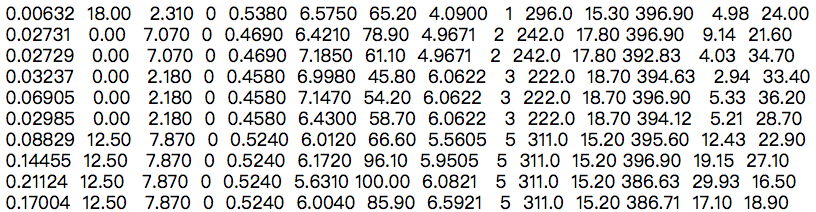

```python
# 使用np.fromfile从文本文件'housing.data'读入数据
# 这里要设置参数sep = ' '，表示使用空白字符来分隔数据
# 空格或者回车都属于空白字符，读入的数据被转化成1维数组
d = np.fromfile('./work/housing.data', sep = ' ')
```

### 2. 文件保存

Numpy提供了save和load接口，直接将数组保存成文件(保存为.npy格式)，或者从.npy文件中读取数组。

```python
# 产生随机数组a
a = np.random.rand(3,3)
np.save('a.npy', a)

# 从磁盘文件'a.npy'读入数组
b = np.load('a.npy')

# 检查a和b的数值是否一样
check = (a == b).all()
```

## 九、Numpy应用举例

### 1. 计算激活函数Sigmoid和ReLU

使用ndarray数组可以很方便的构建数学函数，并利用其底层的矢量计算能力快速实现计算。下面以神经网络中比较常用激活函数Sigmoid和ReLU为例，介绍代码实现过程。

```python
# ReLU和Sigmoid激活函数示意图
import numpy as np
import matplotlib.pyplot as plt
import matplotlib.patches as patches

#设置图片大小
plt.figure(figsize=(8, 3))

# x是1维数组，数组大小是从-10. 到10.的实数，每隔0.1取一个点
x = np.arange(-10, 10, 0.1)
# 计算 Sigmoid函数
s = 1.0 / (1 + np.exp(- x))

# 计算ReLU函数
y = np.clip(x, a_min = 0., a_max = None)

#########################################################
# 以下部分为画图程序

# 设置两个子图窗口，将Sigmoid的函数图像画在右边
f = plt.subplot(121)
# 画出函数曲线
plt.plot(x, s, color='r')
# 添加文字说明
plt.text(-5., 0.9, r'$y=\sigma(x)$', fontsize=13)
# 设置坐标轴格式
currentAxis=plt.gca()
currentAxis.xaxis.set_label_text('x', fontsize=15)
currentAxis.yaxis.set_label_text('y', fontsize=15)

# 将ReLU的函数图像画在左边
f = plt.subplot(122)
# 画出函数曲线
plt.plot(x, y, color='g')
# 添加文字说明
plt.text(-3.0, 9, r'$y=ReLU(x)$', fontsize=13)
# 设置坐标轴格式
currentAxis=plt.gca()
currentAxis.xaxis.set_label_text('x', fontsize=15)
currentAxis.yaxis.set_label_text('y', fontsize=15)

plt.show()
```

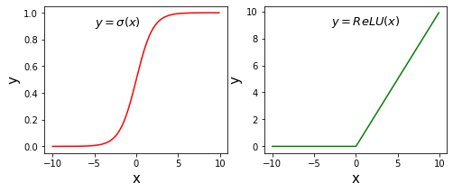

### 2. 图像翻转和裁剪

图像是由像素点构成的矩阵，其数值可以用ndarray来表示。将上述介绍的操作用在图像数据对应的ndarray上，可以很轻松的实现图片的翻转、裁剪和亮度调整，具体代码和效果如下所示。

```python
# 导入需要的包
import numpy as np
import matplotlib.pyplot as plt
from PIL import Image

# 读入图片
image = Image.open('bus.png')
image = np.array(image)
# 查看数据形状，其形状是[H, W, 3]，
# 其中H代表高度， W是宽度，3代表RGB三个通道
image.shape #(612, 612, 3)
# 原始图片
plt.imshow(image)
```


```python
# 垂直方向翻转
# 这里使用数组切片的方式来完成，
# 相当于将图片最后一行挪到第一行，
# 倒数第二行挪到第二行，..., 
# 第一行挪到倒数第一行
# 对于行指标，使用::-1来表示切片，
# 负数步长表示以最后一个元素为起点，向左走寻找下一个点
# 对于列指标和RGB通道，仅使用:表示该维度不改变
image1 = image[::-1, :, :]
plt.imshow(image1)
```

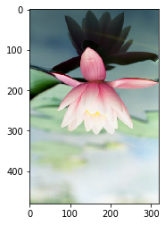

```python
# 水平方向翻转
image2 = image[:, ::-1, :]
plt.imshow(image2)
# 保存图片
im2 = Image.fromarray(image2)
im2.save('im2.jpg')
```

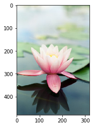

```python
#  高度方向裁剪
H, W = image.shape[0], image.shape[1]
# 注意此处用整除，H_start必须为整数
H1 = H // 2 
H2 = H
image3 = image[H1:H2, :, :]
plt.imshow(image3)
```

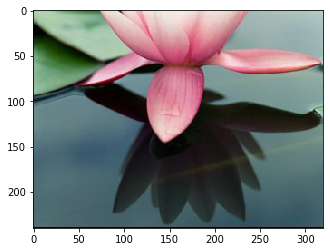

```python
#  宽度方向裁剪
W1 = W//6
W2 = W//3 * 2
image4 = image[:, W1:W2, :]
plt.imshow(image4)
```

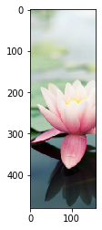

```python
# 两个方向同时裁剪
image5 = image[H1:H2, \
               W1:W2, :]
plt.imshow(image5)
```

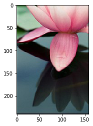

```python
# 调整亮度
image6 = image * 0.5
plt.imshow(image6.astype('uint8'))
```

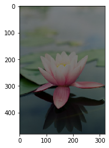

```python
# 调整亮度
image7 = image * 2.0
# 由于图片的RGB像素值必须在0-255之间，
# 此处使用np.clip进行数值裁剪
image7 = np.clip(image7, \
        a_min=None, a_max=255.)
plt.imshow(image7.astype('uint8'))
```

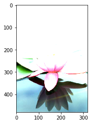

```python
#高度方向每隔一行取像素点
image8 = image[::2, :, :]
plt.imshow(image8)
```

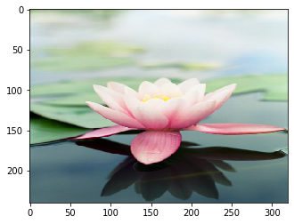

```python
#宽度方向每隔一列取像素点
image9 = image[:, ::2, :]
plt.imshow(image9)
```

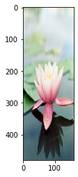

```python
#间隔行列采样，图像尺寸会减半，清晰度变差
image10 = image[::2, ::2, :]
plt.imshow(image10)
print(image10.shape) # (240, 160, 3)
```

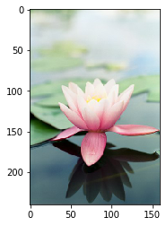